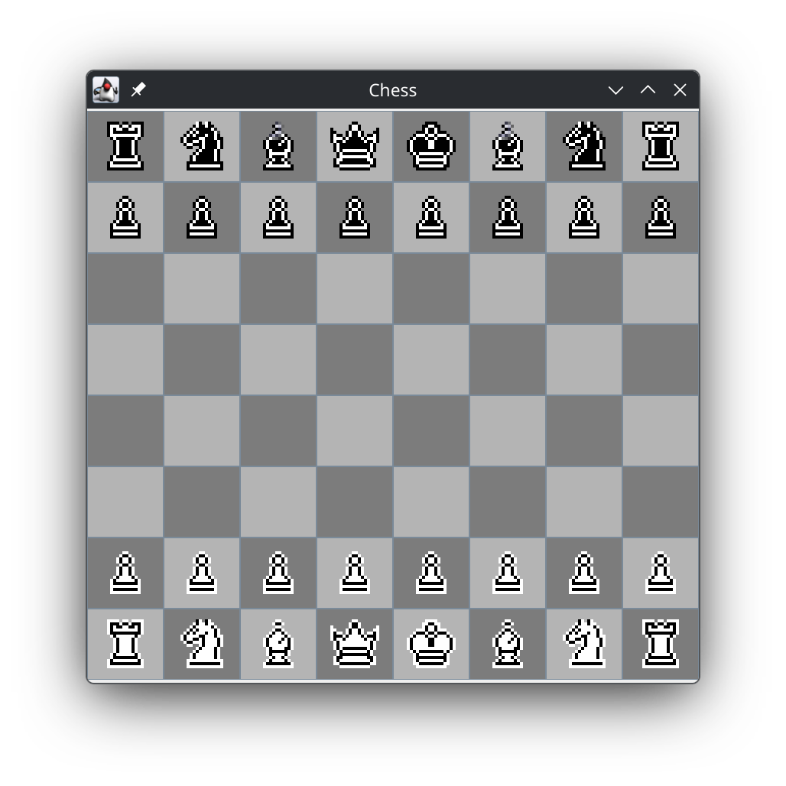
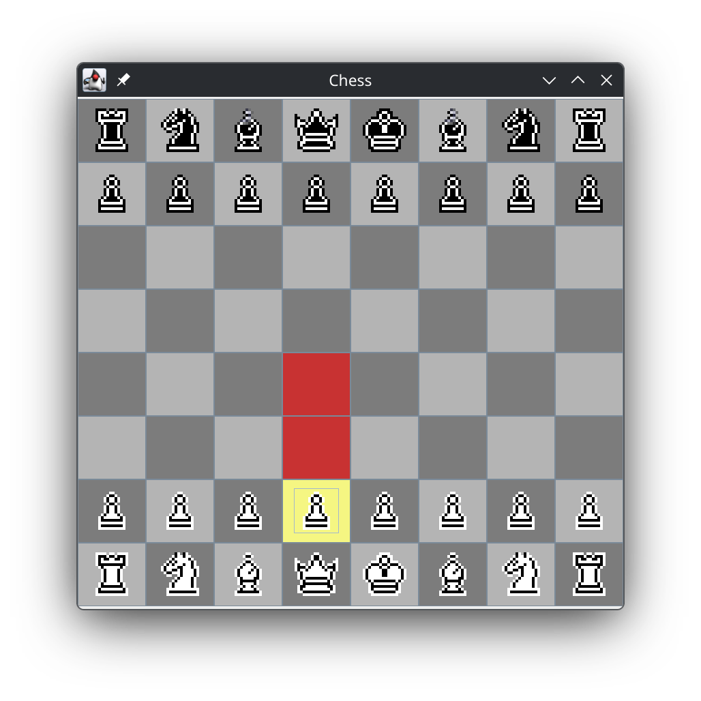

<h1>Chessboard</h1>
A Java-based chess engine, which uses Bitboard movement on the backend, complete move validation, FEN & PGN string utilities, and a Swing GUI. Includes depth testing.

## Features

- Bitboard engine: 64-bit Bitboard architecture for fast processing of future moves using bitwise operations.
- Rule validation: only allows legal chess moves to be played
- Move history: allows undoing and redoing of moves
- FEN & PGN utilities: includes the usage of FEN strings and PGN strings to generate board states and play games.
- Swing UI: local play & play vs computer
- AI interface for custom AI's to be used
- Verification of game state using perft depth testing
    - Initial position testing to Depth 6
    - Kiwipete position testing to Depth 5

## Build
**Prerequisites:**
- JDK 17+
- Maven 3.8+

### Run tests
```bash
mvn clean test
```

### Build Package
```bash
mvn clean package
```

### Launch the GUI
```bash
mvn compile exec:java -Dexec.mainClass="Main"
```

## Screenshots

<div align="center">
    
</div>

<div align="center">
    
</div>

## Future Work
- Minimax AI with Alpha-Beta pruning
- Research and implement the Universal Chess Interface
- P2P multiplayer support
